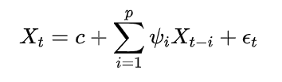

# AR - Autogressive 自回归

工具包：statsmodels

## 什么是自回归
自回归模型，输出变量线性地取决于**先前的值**和**随机项**。

使用所有历史数据加权预测下一个值：

常数、模型参数、白噪声

## 适用

适用于没有**趋势**和**季节性**成分的单变量时间序列

一般不单独用，会与[MA](../MA/README.md)模型一起，组成时间序列自回归移动平均[ARMA](../ARMA/README.md)以及自回归综合移动平均模型[ARIMA](../ARIMA/README.md)

它也是自回归模型[VAR](../VAR/README.md)的一个特例，由一个包含多个互锁随机差分方程的系统组成。

## 问题

为什么ar输入值是两个len(data)??